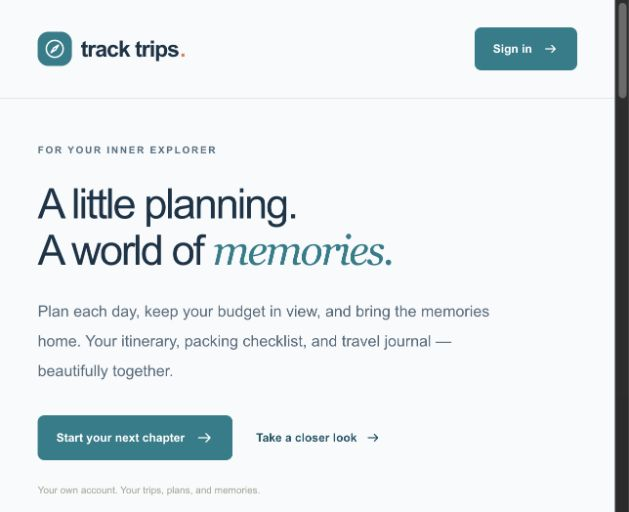

# Track Trips

Plan your trip. Keep your memories. Inspire the next journey.

Track Trips brings daily itineraries, budgets, packing lists, and a private travel journal into one account. Publish selected memories as public stories, save inspiration, and use a story to start your own private trip plan.

[Open Track Trips](https://tracktrips-app.vercel.app) · [Explore stories](https://tracktrips-app.vercel.app/explore)



## Features

- Private trips and journal entries with account-scoped photo storage.
- Daily activities, booking links, packing checklists, and itinerary exports.
- Estimated and recorded spending in integer minor units; currency labels do not convert amounts.
- Opt-in public stories, private bookmarks, and story-to-trip templates with author credit.
- Protected report review with moderation holds and decision history.
- Responsive layouts, reduced-motion support, and keyboard navigation.

## Run locally

Requires Node.js 22 and a configured Supabase project.

```sh
npm ci
cp .env.example .env.local
# Configure your Supabase project URL, publishable key, and APP_ORIGIN.
npm run dev
```

Follow [Supabase setup](docs/supabase-setup.md) for migrations, authentication URLs, email templates, and ownership checks. Open the app using the configured local origin. Without Supabase configuration, authenticated routes remain protected. Never put service-role keys or database management credentials in the app.

```sh
npm run lint
npm test
npm run build
```

Development uses `.next-dev`; production builds use `.next`.

## Documentation

- [Supabase setup](docs/supabase-setup.md)
- [Public stories and privacy](docs/public-stories.md)
- [Administrator moderation](docs/admin-review.md)
- [Vercel deployment and automatic releases](docs/vercel-deployment.md)

## Data and security

User identity is checked on the server, and database policies isolate private workspaces. Session cookies are HttpOnly and Secure in production. Mutations validate request origin; conflicting workspace edits are rejected using a revision check.

Workspaces are bounded JSONB records: 500 trips, 2,000 memories, and 8 MB per account, with photos stored separately. Larger workspaces or collaboration need a different data model. Existing browser-local preview records can be imported explicitly; originals remain on the device. Downloads are snapshots, not a verified restore flow.

Before public onboarding, configure reliable SMTP and exact authentication redirects, test account recovery and ownership with separate accounts, and verify database/photo backup restoration. Moderation has no background notification service. Offline access, currency conversion, and team collaboration are not implemented.
